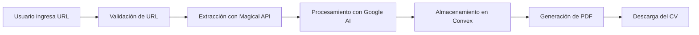

# 📄 LinkedIn CV Generator

[](https://nextjs.org/)
[](https://www.typescriptlang.org/)
[](https://www.convex.dev/)

> Generador automático de CVs profesionales a partir de perfiles de LinkedIn utilizando tecnologías modernas y procesamiento con IA.

## 🎯 Descripción

LinkedIn CV Generator es una aplicación web que permite crear currículums profesionales en formato PDF de manera automática. Simplemente ingresando la URL de un perfil de LinkedIn, la aplicación extrae, procesa y formatea la información para generar un CV descargable y profesional.

### ¿Por qué usar este generador?

- ⚡ **Ahorra tiempo**: Genera CVs en segundos en lugar de horas
- 🎨 **Formato profesional**: Diseño limpio y estructurado automáticamente
- 🤖 **IA integrada**: Mejora y optimiza la información del perfil
- 📱 **Responsive**: Funciona en cualquier dispositivo
- 🔄 **Tiempo real**: Base de datos reactiva con Convex

---

## ✨ Características

### Frontend
- 🚀 **Next.js 15** con App Router y renderizado optimizado
- ⚡ **Turbopack** para compilación ultra rápida
- 🎨 **React** con TypeScript para desarrollo type-safe
- 💅 **Tailwind CSS** para estilos modernos y responsivos

### Backend & Base de Datos
- ☁️ **Convex** como backend serverless con base de datos en tiempo real
- 🔄 **Sincronización reactiva** de datos
- 🔐 **Validación de datos** con esquemas de Convex

### Integraciones IA & APIs
- 🤖 **Google Generative AI** para procesamiento inteligente de texto
- 🔑 **Magical API** para extracción estructurada de perfiles de LinkedIn
- 📊 Limpieza y optimización automática de información

### Generación de PDF
- 📄 **@react-pdf/renderer** para exportación profesional
- 🎨 Plantillas personalizables
- 📥 Descarga instantánea

---

## 🔄 Flujo de la Aplicación



1. **Entrada**: El usuario proporciona la URL de un perfil de LinkedIn
2. **Validación**: Se verifica que la URL sea válida
3. **Extracción**: Magical API obtiene los datos estructurados del perfil
4. **Procesamiento**: Google Generative AI limpia y optimiza la información
5. **Almacenamiento**: Los datos se guardan en Convex para acceso rápido
6. **Generación**: Se crea un PDF profesional con @react-pdf/renderer
7. **Entrega**: El usuario descarga su CV listo para usar

---

## ⚙️ Requisitos Previos

Antes de comenzar, asegúrate de tener instalado:

- **Node.js** v18.0.0 o superior ([Descargar](https://nodejs.org/))
- **npm** v9.0.0+ o **yarn** v1.22.0+ o **pnpm** v8.0.0+
- **Git** para clonar el repositorio

### Cuentas y API Keys necesarias

- ☁️ [Cuenta en Convex](https://www.convex.dev/) (Gratis)
- 🤖 [Google Generative AI API Key](https://ai.google.dev/) (Gratis con límites)
- 🔑 [Magical API Key](https://www.magicalapi.com/) (Requiere plan)

---

## 🚀 Instalación

### 1. Clonar el repositorio

```bash
git clone https://github.com/mig-garzon/linkedin-cv-generator.git
cd linkedin-cv-generator
```

### 2. Instalar dependencias

```bash
npm install
# o
yarn install
# o
pnpm install
```

### 3. Configurar variables de entorno

Crea un archivo `.env.local` en la raíz del proyecto con las siguientes variables:

```env
# Convex Configuration
CONVEX_DEPLOYMENT="your-deployment-id"
NEXT_PUBLIC_CONVEX_URL="https://your-deployment.convex.cloud"

# API Keys
GOOGLE_GENERATIVE_AI_API_KEY="your-google-ai-api-key"
MAGICAL_API_KEY="your-magical-api-key"
```

### 4. Configurar Convex

```bash
# Iniciar sesión en Convex
npx convex login

# Inicializar el proyecto
npx convex dev
```

### 5. Ejecutar en desarrollo

```bash
npm run dev
# o
yarn dev
# o
pnpm dev
```

La aplicación estará disponible en `http://localhost:3000`

---

## 📁 Estructura del Proyecto

```
linkedin-cv-generator/
├── app/                      # Next.js App Router
│   ├── actions/             # Server Actions
│   │   └── generateCV.ts    # Lógica de generación de CV
│   ├── components/          # Componentes React
│   │   ├── CVPreview.tsx    # Vista previa del CV
│   │   ├── LoadingSpinner.tsx
│   │   └── URLInput.tsx     # Input para URL de LinkedIn
│   ├── api/                 # API Routes
│   ├── globals.css          # Estilos globales
│   ├── layout.tsx           # Layout principal
│   └── page.tsx             # Página principal
├── convex/                   # Convex Backend
│   ├── schema.ts            # Esquemas de base de datos
│   ├── cvs.ts               # Funciones para CVs
│   └── _generated/          # Archivos generados
├── hooks/                    # Custom React Hooks
│   ├── useDownloadPdf.ts    # Hook para descargar PDF
│   ├── useGenerateCV.ts     # Hook para generar CV
│   └── useLinkedInUrl.ts    # Hook para validar URL
├── services/                 # Servicios externos
│   ├── linkedinService.ts   # Integración con Magical API
│   ├── aiService.ts         # Integración con Google AI
│   └── pdfService.ts        # Generación de PDF
├── utils/                    # Utilidades
│   ├── validateUrl.ts       # Validación de URLs
│   ├── pdfTemplate.ts       # Plantilla del PDF
│   └── ConvexClientProvider.tsx
├── public/                   # Archivos estáticos
│   ├── favicon.ico
│   └── logo.png
├── .env.local               # Variables de entorno (no subir a git)
├── .gitignore
├── next.config.js           # Configuración de Next.js
├── package.json
├── tsconfig.json            # Configuración de TypeScript
└── README.md
```

---

## 🎨 Uso

### Generar un CV

1. Abre la aplicación en tu navegador
2. Ingresa la URL completa de un perfil público de LinkedIn
   - Ejemplo: `https://www.linkedin.com/in/username`
3. Haz clic en "Generar CV"
4. Espera mientras se procesa la información (10-30 segundos)
5. Visualiza la vista previa del CV generado
6. Descarga el PDF haciendo clic en "Descargar CV"

### Personalizar el CV

Puedes personalizar la plantilla del PDF editando:
- `utils/pdfTemplate.ts` - Estructura y diseño
- `services/pdfService.ts` - Lógica de generación

---

## 🛠️ Scripts Disponibles

```bash
# Desarrollo
npm run dev          # Inicia el servidor de desarrollo

# Convex
npm run convex:dev   # Inicia Convex en modo desarrollo
npm run convex:deploy # Despliega funciones a Convex

# Producción
npm run build        # Construye la aplicación
npm run start        # Inicia el servidor de producción

# Calidad de código
npm run lint         # Ejecuta ESLint
npm run type-check   # Verifica tipos de TypeScript
```

---

## 🔧 Tecnologías Utilizadas

| Tecnología | Propósito | Versión |
|-----------|-----------|---------|
| Next.js | Framework React | 15.x |
| TypeScript | Lenguaje | 5.x |
| React | UI Library | 18.x |
| Convex | Backend & Database | Latest |
| Tailwind CSS | Estilos | 3.x |
| @react-pdf/renderer | Generación PDF | Latest |
| Google Generative AI | Procesamiento IA | Latest |
| Magical API | Scraping LinkedIn | Latest |

---

## 🌐 Despliegue

### Vercel (Recomendado)

1. Sube tu código a GitHub
2. Conecta tu repositorio en [Vercel](https://vercel.com)
3. Configura las variables de entorno
4. Despliega automáticamente

### Variables de entorno en producción

Asegúrate de configurar todas las variables de `.env.local` en tu plataforma de despliegue.


### Guías de contribución

- Usa TypeScript para todo el código
- Sigue las convenciones de código del proyecto
- Escribe tests cuando sea posible
- Actualiza la documentación si es necesario


---

## 🙏 Agradecimientos

- [Next.js Team](https://nextjs.org/) por el increíble framework
- [Convex](https://www.convex.dev/) por el backend serverless
- [Google AI](https://ai.google.dev/) por las capacidades de IA
- [Magical API](https://www.magicalapi.com/) por la extracción de datos


---

## 🔮 Roadmap

- [ ] Múltiples plantillas de CV
- [ ] Soporte para múltiples idiomas
- [ ] Editor de CV en línea
- [ ] Exportación a otros formatos (DOCX, HTML)
- [ ] Sistema de autenticación de usuarios
- [ ] Historial de CVs generados
- [ ] Comparación de CVs
- [ ] Sugerencias de mejora con IA

---
